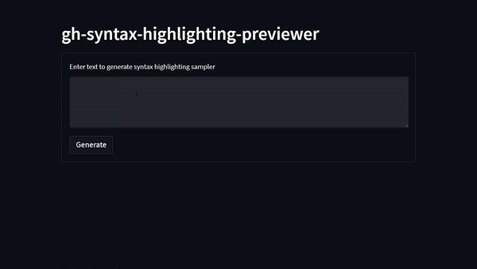

# gh-syntax-highlighting-previewer
Generates markdown for your text in every GitHub syntax highlighting scheme, 
so you can see how your text looks in every scheme quickly:



Pseudocode of what the goal of this repo is:
```
for each syntax highlighting scheme that github accepts
    print the scheme's name
    print ```{syntax highlighting scheme}
    print input text
    print ```
```

With this, you can copy the output and paste it into a GitHub markdown editor and see which colour scheme you want.


# Usage
There are two ways to run this program.
1. Visit the streamlit web app at , as shown in the gif above.
2. Run the streamlit app locally. (Install Python, pip install -r requirements.txt, streamlit run app.py)
3. Read main.py, fill in the input_text, and run the script with Python


# Backstory

GitHub doesn't allow coloured text, and I needed to put some into a Gist because it was going
to be part of a blog post and screenshots of text were unacceptable. If I wanted to differentiate text by colour,
I needed to hope that one of the syntax highlighting schemes that you can put after ``` would colour my text the right colour. 
Testing each scheme one-at-a-time would take a really long time, so instead, I made a script which generates all the possible code
blocks with your input text, so you can paste it into a GitHub page and preview every syntax highlighting scheme. It's a really
obvious solution in hindsight but 
